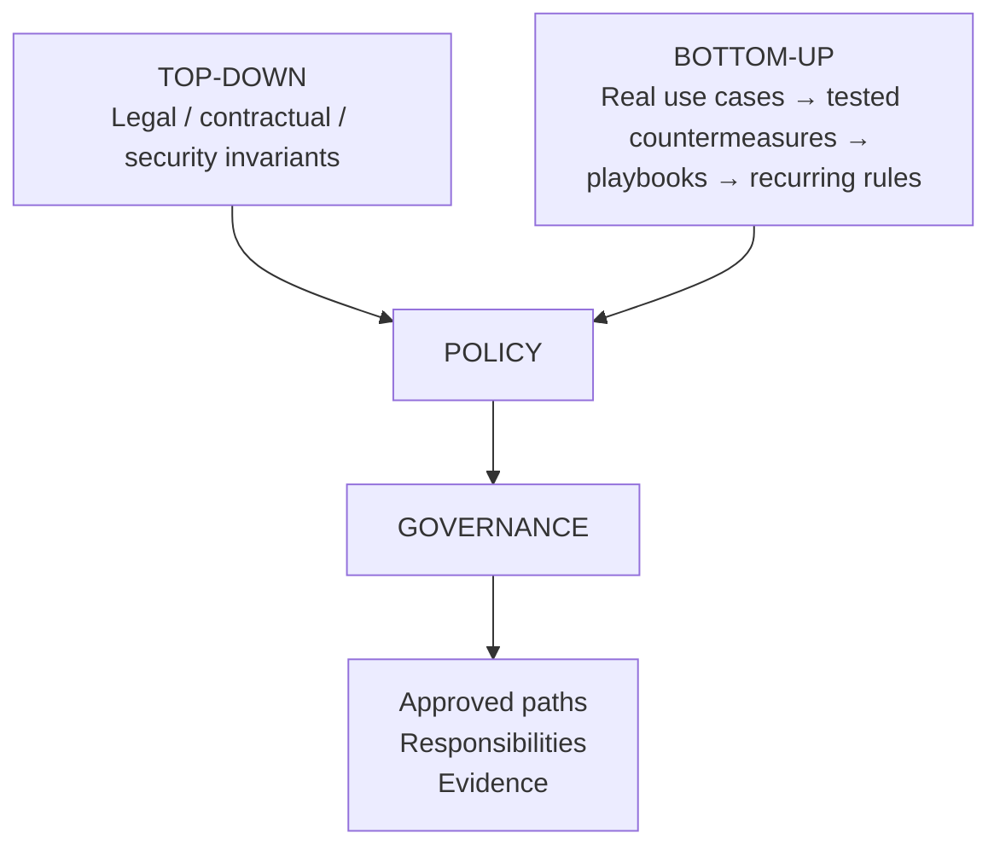

# AI Exposure Lab

> **Is there a pilot in the plane? ✈️**

**A practical lab to help organizations start governing AI use at work.**

AI is already part of everyday work. Employees, managers, developers,
administrators, suppliers, partners and customers can all use it to save time,
analyze information, reason about problems and automate actions.

That is not the problem.

People use AI because it creates value. The problem starts when we no longer
clearly understand **why it is being used, what business value is at stake,
what we expose to it, what we delegate to it, what it can do and who remains
responsible**.

> **Start with the problem, not the framework.**

## Start with the business

Before talking about AI controls, ask two questions:

> **Why is AI being used here?**  
> **Why could this particular use become a problem for the business?**

Understand the expected result first.

Identify what has value: customers, people, knowledge, intellectual property,
decisions, operations, reputation, money or availability.

Then look at how AI touches that value.

## Frame the use

For each real use case, observe four factual dimensions:

```text
CHANNEL
Is the use known, approved and managed?

EXPOSURE
What information reaches AI?

COGNITIVE DELEGATION
What thinking do we give AI?

ACTION DELEGATION
What can AI actually do?
```

Exposure may involve emails, source code, customer data, HR data, architecture,
logs, credentials or business context.

Cognitive delegation may include summarizing, analyzing, comparing, inferring,
reasoning, recommending, planning or deciding.

Action delegation may include reading, creating, sending, modifying, executing
or deleting.

An approved tool does not automatically make every use case approved.

> **Access right ≠ disclosure authority.**

## Break it

Change perspective.

> **If I wanted to damage this business value for my own benefit, what would I
> try to achieve?**

Then remove the attacker:

> **What could simply go wrong?**

The goal is not to create a huge risk register.

It is to understand the real problem and define what must remain true for the
business.

## Fix the cause, not the symptom

When a problem appears, use a simple Root Cause Countermeasure approach:

```text
PROBLEM
What is actually wrong?

ROOT CAUSE
Why is it happening?

COUNTERMEASURE
What is the smallest durable response?
```

Do not assume the user is the problem.

Someone using a personal AI account may simply be trying to get their job done
because no useful approved path exists.

Explain the business risk without blaming or judging the person, then help them
achieve the same result more safely.

> **Make the safe path easier than the unsafe one.**

## Prove it

A countermeasure is not useful because it exists.

It is useful because it works.

Test the risky path.

Test the approved path.

Look for obvious bypasses.

Check whether the team can still achieve the expected business result.

If the response creates too much friction, people may simply move the behavior
somewhere less visible.

## From use cases to governance

Governance should combine two directions.



**Top-down requirements** define what cannot be negotiated.

**Bottom-up learning** shows how those requirements can work in the real world.

Business teams remain at the center.

Security, HR, Legal / Privacy, IT / Architecture, Procurement and Management
bring different views when they are relevant.

The objective is not to say **no** to AI.

It is to understand why people use it, protect what matters and enable safer
use.

## External drivers

The lab starts from real business use cases, but governance does not emerge
from observation alone.

Organizations may also have non-negotiable legal, contractual or regulatory
requirements.

In Europe, NIS2 is one example.

Its risk-management approach covers areas such as:

- governance and risk management
- incident management
- business continuity
- supply-chain security
- secure acquisition, development and maintenance
- effectiveness of security measures
- cyber hygiene and training

These requirements belong to the **top-down** side of the model.

They define what must be achieved.

The lab then uses real use cases to understand how those objectives can be met
in practice without losing sight of the business need.

## Quick start

1. Pick one real AI use case from a team.
2. Run the [Quick AI Use Case Review](doc/quick-review.md).
3. Challenge the risky parts and find the root cause.
4. Define the smallest useful countermeasure.
5. Prove it works in reality.
6. Turn the result into a short [playbook](doc/playbooks.md).
7. Promote only recurring, validated rules into [policy](doc/policy.md).

The initial lab uses five practical areas: **HR / Talent Acquisition, Sales,
SysAdmin, Development and Suppliers / Third Parties**.

See [use-cases.md](doc/use-cases.md).

> **Build. Break. Understand. Rebuild better.**