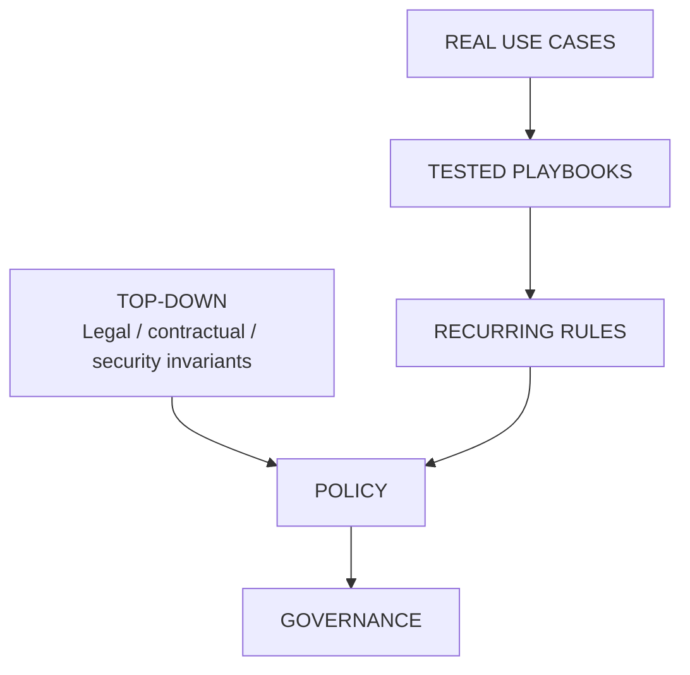

# Policy: Build It From What We Learn

Do not start this lab by writing an AI policy.

Policy should combine two sources:

- non-negotiable legal, contractual and security requirements;
- repeated, validated lessons from real use cases and playbooks.

Top-down requirements define what must remain true.

Bottom-up learning helps determine how those requirements can work in practice.

Policy should therefore not be disconnected from the reality of the people who
need to apply it.

## Candidate rules

The following are **policy candidates**, not a finished policy:

- use approved AI environments for non-public business information;
- expose only the information required for the task;
- access to information does not automatically grant authority to disclose it
  to an AI service;
- do not expose credentials or authentication secrets to general-purpose AI
  services;
- keep clear human ownership for high-impact business decisions;
- give AI agents only the permissions required for their task;
- make significant AI actions traceable;
- provide a usable approved path when AI creates legitimate business value;
- review supplier AI usage when the supplier handles important company value
  or information.

## Validation

A recurring rule should be challenged from several perspectives before it
becomes policy:

**Business**  
Does it still allow the expected result?

**Security**  
Does it protect the value against relevant abuse and failure?

**HR**  
Does cognitive delegation change roles, skills, responsibilities or work
organization?

**Legal / Privacy**  
Are disclosure, personal data, contracts, intellectual property and
responsibility properly addressed?

**IT / Architecture**  
Can the safe path be operated and controlled?

**Procurement / Third Party**  
Do supplier commitments and evidence match the requirement?

**Management**  
Who accepts residual risk and approves the rule?

The policy should remain short, understandable and connected to the playbooks
that explain how to apply it.